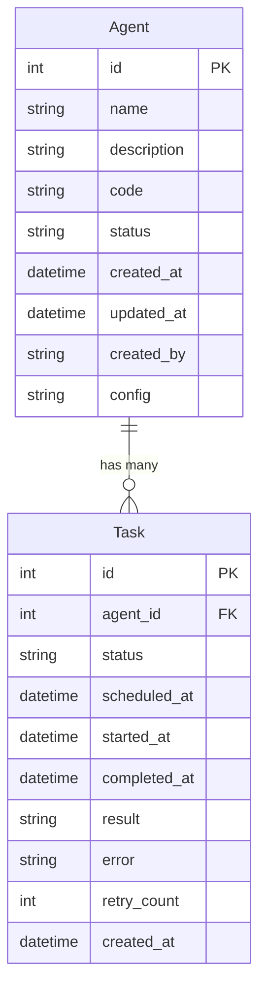

# Database Models

## סקירה

SQLModel schemas המגדירים את ה-entities של Agent Platform.

```python
from src.models import Agent, Task
from sqlmodel import select

# Create agent
agent = Agent(
    name="Stock Monitor",
    description="עוקב אחרי מניות טסלה",
    code="# Generated code here",
    status="active"
)
session.add(agent)
await session.commit()

# Query agents
result = await session.execute(select(Agent))
agents = result.scalars().all()
```

---

## Agent Model

::: src.models.agent.Agent
    options:
      show_root_heading: true
      heading_level: 3
      members:
        - id
        - name
        - description
        - code
        - status
        - created_at
        - updated_at
        - created_by
        - config

### Agent Attributes

| Field | Type | Description | Constraints |
|-------|------|-------------|-------------|
| `id` | `int \| None` | Unique identifier | Primary key, auto-generated |
| `name` | `str` | Agent name | Max 255 chars, indexed |
| `description` | `str` | Natural language description | Max 2000 chars |
| `code` | `str` | Generated Python code | TEXT field |
| `status` | `str` | Current status | Max 50 chars, default="active", indexed |
| `created_at` | `datetime` | Creation timestamp | Auto-generated |
| `updated_at` | `datetime` | Last update timestamp | Auto-generated |
| `created_by` | `str \| None` | Creator identifier | Max 255 chars, optional |
| `config` | `str \| None` | JSON configuration | TEXT field, optional |

### Agent Status Values

- **active** - Agent is running
- **paused** - Agent is temporarily stopped
- **stopped** - Agent is permanently stopped
- **error** - Agent encountered an error

### Example

```python
agent = Agent(
    name="Stock Monitor Agent",
    description="סוכן שעוקב אחרי מניות של טסלה ומתריע כאשר המחיר עולה ב-5%",
    code="# Generated agent code here",
    status="active",
    config='{"stocks": ["TSLA"], "threshold": 0.05}'
)
```

---

## Task Model

::: src.models.task.Task
    options:
      show_root_heading: true
      heading_level: 3
      members:
        - id
        - agent_id
        - status
        - scheduled_at
        - started_at
        - completed_at
        - result
        - error
        - retry_count
        - created_at

### Task Attributes

| Field | Type | Description | Constraints |
|-------|------|-------------|-------------|
| `id` | `int \| None` | Unique identifier | Primary key, auto-generated |
| `agent_id` | `int` | Foreign key to agents | Indexed |
| `status` | `str` | Task status | Max 50 chars, default="pending", indexed |
| `scheduled_at` | `datetime` | Scheduled execution time | Indexed, auto-generated |
| `started_at` | `datetime \| None` | Actual start time | Optional |
| `completed_at` | `datetime \| None` | Completion time | Optional |
| `result` | `str \| None` | Execution result/output | TEXT field, optional |
| `error` | `str \| None` | Error message if failed | TEXT field, optional |
| `retry_count` | `int` | Number of retry attempts | Default=0 |
| `created_at` | `datetime` | Creation timestamp | Auto-generated |

### Task Status Values

- **pending** - Waiting to execute
- **running** - Currently executing
- **completed** - Successfully finished
- **failed** - Execution failed

### Example

```python
task = Task(
    agent_id=1,
    status="completed",
    scheduled_at=datetime.utcnow(),
    started_at=datetime.utcnow(),
    completed_at=datetime.utcnow(),
    result="Stock price increased by 6.2%",
    retry_count=0
)
```

---

## Relationships



---

## Usage Patterns

### Creating an Agent with Tasks

```python
from src.models import Agent, Task
from src.api.database import get_session

async with async_session_maker() as session:
    # Create agent
    agent = Agent(
        name="Daily Report Agent",
        description="שולח דוח יומי בשעה 9 בבוקר",
        code="# Generated code",
        status="active"
    )
    session.add(agent)
    await session.commit()
    await session.refresh(agent)

    # Create task for this agent
    task = Task(
        agent_id=agent.id,
        status="pending",
        scheduled_at=datetime.utcnow() + timedelta(hours=1)
    )
    session.add(task)
    await session.commit()
```

### Querying Agent Execution History

```python
from sqlmodel import select

async with async_session_maker() as session:
    # Get agent with all its tasks
    statement = select(Task).where(Task.agent_id == agent_id)
    result = await session.execute(statement)
    tasks = result.scalars().all()

    # Get only failed tasks
    statement = select(Task).where(
        Task.agent_id == agent_id,
        Task.status == "failed"
    )
    failed_tasks = await session.execute(statement)
```

### Updating Task Status

```python
async with async_session_maker() as session:
    # Start task execution
    task.status = "running"
    task.started_at = datetime.utcnow()
    session.add(task)
    await session.commit()

    # Complete task
    task.status = "completed"
    task.completed_at = datetime.utcnow()
    task.result = "Execution successful"
    await session.commit()
```

---

## Type Hints

כל ה-models משתמשים ב-modern Python type hints:

```python
# ✅ Modern (Python 3.10+)
id: int | None
config: str | None

# ❌ Deprecated
id: Optional[int]
config: Optional[str]
```
