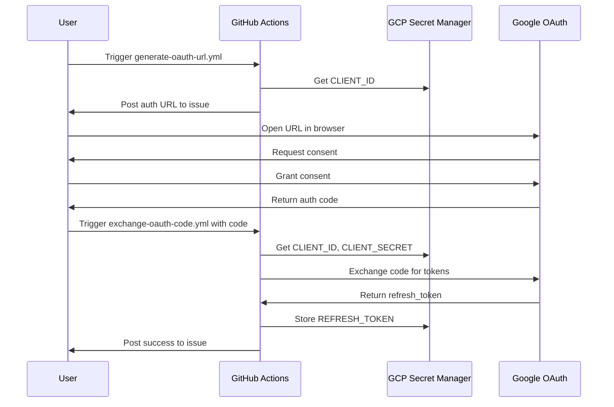
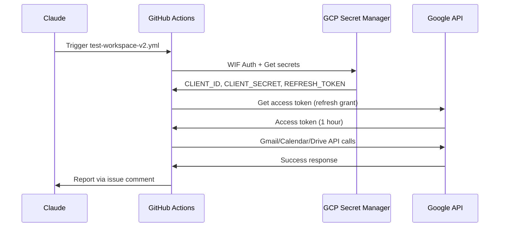

# 10. Google Workspace Integration

**Status**: Full Autonomy Verified (2026-01-16)
**Services**: Gmail, Calendar, Drive, Sheets, Docs

---

## Overview

This document describes the Google Workspace integration architecture that enables Claude to autonomously interact with Gmail, Calendar, Drive, Sheets, and Docs services.

## Architecture

```
┌─────────────────────────────────────────────────────────────────┐
│                    Claude Code Session                          │
└─────────────────────────────────────────────────────────────────┘
                              │
                              ▼
┌─────────────────────────────────────────────────────────────────┐
│                    GitHub Actions Workflow                       │
│  ┌─────────────────────────────────────────────────────────────┐│
│  │         GCP WIF Authentication                               ││
│  │         (Workload Identity Federation)                       ││
│  └─────────────────────────────────────────────────────────────┘│
└─────────────────────────────────────────────────────────────────┘
                              │
                              ▼
┌─────────────────────────────────────────────────────────────────┐
│                  GCP Secret Manager                              │
│  ┌──────────────────┐ ┌──────────────────┐ ┌──────────────────┐ │
│  │GOOGLE-OAUTH-     │ │GOOGLE-OAUTH-     │ │GOOGLE-OAUTH-     │ │
│  │CLIENT-ID         │ │CLIENT-SECRET     │ │REFRESH-TOKEN     │ │
│  └──────────────────┘ └──────────────────┘ └──────────────────┘ │
└─────────────────────────────────────────────────────────────────┘
                              │
                              ▼
┌─────────────────────────────────────────────────────────────────┐
│                 Google OAuth 2.0 Token Endpoint                  │
│                 https://oauth2.googleapis.com/token              │
└─────────────────────────────────────────────────────────────────┘
                              │
                              ▼
┌─────────────────────────────────────────────────────────────────┐
│                    Google Workspace APIs                         │
│  ┌─────────┐ ┌──────────┐ ┌───────┐ ┌────────┐ ┌──────┐        │
│  │  Gmail  │ │ Calendar │ │ Drive │ │ Sheets │ │ Docs │        │
│  └─────────┘ └──────────┘ └───────┘ └────────┘ └──────┘        │
└─────────────────────────────────────────────────────────────────┘
```

## OAuth Flow

### Initial Setup (One-Time, Requires Human)



### Runtime Flow (Autonomous)



## Secrets Configuration

| Secret | Location | Description |
|--------|----------|-------------|
| `GOOGLE-OAUTH-CLIENT-ID` | GCP Secret Manager | OAuth 2.0 Client ID from GCP Console |
| `GOOGLE-OAUTH-CLIENT-SECRET` | GCP Secret Manager | OAuth 2.0 Client Secret |
| `GOOGLE-OAUTH-REFRESH-TOKEN` | GCP Secret Manager | Long-lived refresh token (6 months if unused) |

## API Scopes

The following OAuth scopes are requested:

```
https://www.googleapis.com/auth/gmail.modify
https://www.googleapis.com/auth/gmail.send
https://www.googleapis.com/auth/calendar
https://www.googleapis.com/auth/drive
https://www.googleapis.com/auth/spreadsheets
https://www.googleapis.com/auth/documents
```

## Enabled APIs

The following APIs must be enabled in GCP project `979429709900`:

| API | Console URL |
|-----|-------------|
| Gmail API | https://console.developers.google.com/apis/api/gmail.googleapis.com |
| Calendar API | https://console.developers.google.com/apis/api/calendar-json.googleapis.com |
| Drive API | https://console.developers.google.com/apis/api/drive.googleapis.com |
| Sheets API | https://console.developers.google.com/apis/api/sheets.googleapis.com |
| Docs API | https://console.developers.google.com/apis/api/docs.googleapis.com |

## Workflow Reference

### generate-oauth-url.yml

Generates OAuth authorization URL and posts to issue #149.

```bash
gh workflow run "Generate OAuth URL" --repo edri2or-commits/project38-or
```

### exchange-oauth-code.yml

Exchanges authorization code for refresh token.

```bash
gh workflow run "Exchange OAuth Code" \
  --repo edri2or-commits/project38-or \
  -f auth_code="4/1ASc3gC..."
```

### verify-oauth-config.yml

Verifies Client ID and Secret are correctly configured.

```bash
gh workflow run "Verify OAuth Config" --repo edri2or-commits/project38-or
```

### check-oauth-secrets.yml

Lists all secrets and their status.

```bash
gh workflow run "Check OAuth Secrets" --repo edri2or-commits/project38-or
```

### test-workspace-v2.yml

Tests Gmail and Calendar APIs.

```bash
gh workflow run "Test Workspace V2" \
  --repo edri2or-commits/project38-or \
  -f email="user@example.com"
```

### test-drive-sheets-docs.yml

Tests Drive, Sheets, and Docs APIs.

```bash
gh workflow run "Test Drive Sheets Docs" --repo edri2or-commits/project38-or
```

## Code Examples

### Gmail: Send Email

```python
from google.oauth2.credentials import Credentials
from googleapiclient.discovery import build
from email.mime.text import MIMEText
import base64

creds = Credentials(
    token=None,
    refresh_token=refresh_token,
    token_uri="https://oauth2.googleapis.com/token",
    client_id=client_id,
    client_secret=client_secret,
)

gmail = build('gmail', 'v1', credentials=creds)

message = MIMEText("Hello from Claude!")
message['to'] = "recipient@example.com"
message['subject'] = "Automated Email"

raw = base64.urlsafe_b64encode(message.as_bytes()).decode()
gmail.users().messages().send(userId='me', body={'raw': raw}).execute()
```

### Calendar: Create Event

```python
calendar = build('calendar', 'v3', credentials=creds)

event = {
    'summary': 'Meeting',
    'start': {'dateTime': '2026-01-17T10:00:00Z', 'timeZone': 'UTC'},
    'end': {'dateTime': '2026-01-17T11:00:00Z', 'timeZone': 'UTC'},
}

calendar.events().insert(calendarId='primary', body=event).execute()
```

### Drive: Create Folder

```python
drive = build('drive', 'v3', credentials=creds)

folder = drive.files().create(
    body={
        'name': 'My Folder',
        'mimeType': 'application/vnd.google-apps.folder'
    },
    fields='id'
).execute()
```

### Sheets: Write Data

```python
sheets = build('sheets', 'v4', credentials=creds)

# Create spreadsheet
spreadsheet = sheets.spreadsheets().create(
    body={'properties': {'title': 'My Sheet'}}
).execute()

# Write data
values = [['Name', 'Value'], ['Item 1', 100], ['Item 2', 200]]
sheets.spreadsheets().values().update(
    spreadsheetId=spreadsheet['spreadsheetId'],
    range='A1:B3',
    valueInputOption='RAW',
    body={'values': values}
).execute()
```

### Docs: Create Document

```python
docs = build('docs', 'v1', credentials=creds)

doc = docs.documents().create(body={'title': 'My Doc'}).execute()

docs.documents().batchUpdate(
    documentId=doc['documentId'],
    body={'requests': [
        {'insertText': {'location': {'index': 1}, 'text': 'Hello World!'}}
    ]}
).execute()
```

## Verification Evidence

All capabilities verified on 2026-01-16:

| Service | Operation | Evidence |
|---------|-----------|----------|
| Gmail | Send email | Message ID: `19bc65f638f5c271` |
| Calendar | Create event | Event ID: `9ke4vrm7to190gugfht64tnoso` |
| Drive | Create folder | Folder ID: `1KezQCmI...` |
| Sheets | Create & write | Sheet ID: `1KS7dfBA...` |
| Docs | Create & insert | Doc ID: `1OwArBwC...` |

## Troubleshooting

### Error: "API has not been used in project"

The API needs to be enabled in GCP Console. Click the link in the error message.

### Error: "invalid_client" or "Unauthorized"

The Client Secret in Secret Manager doesn't match the Client ID. Regenerate and re-store.

### Error: "invalid_grant"

The authorization code expired (10 minutes) or was already used. Generate a new URL.

### Token Refresh Fails

Refresh tokens expire after 6 months of inactivity. Re-authorize with a new consent flow.

## Security Considerations

1. **Refresh tokens never logged** - Only stored in GCP Secret Manager
2. **WIF authentication** - No service account keys
3. **Minimal scopes** - Only requested scopes are granted
4. **Test cleanup** - Test workflows delete created resources

## Related Documents

- [ADR-004: Google Workspace OAuth](../decisions/ADR-004-google-workspace-oauth.md)
- `CLAUDE.md` (root) - Project context
- [06-security-architecture-hybrid.md](06-security-architecture-hybrid.md) - Security patterns
